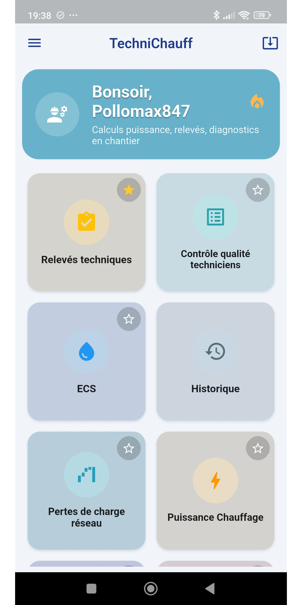
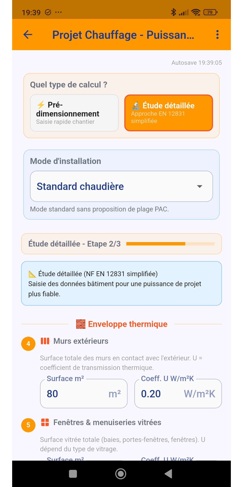
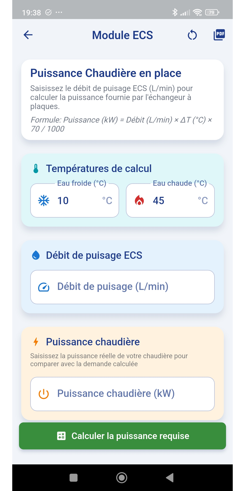
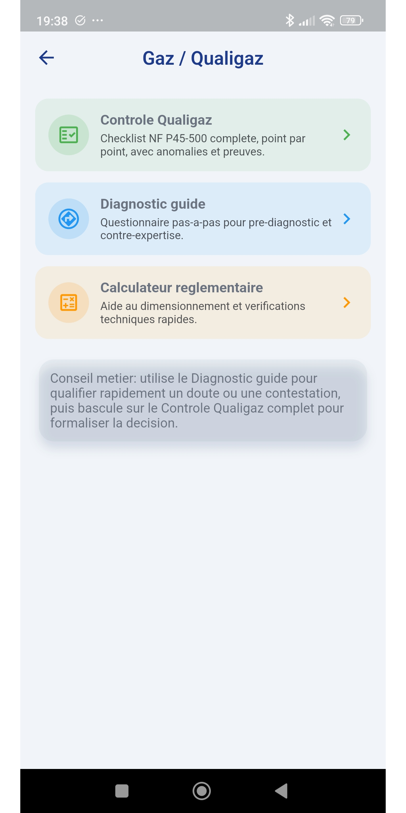
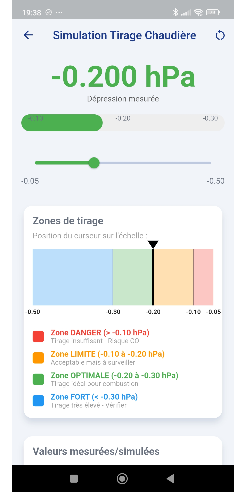

  

  # TechniChauff

  **L'assistant mobile du chauffagiste terrain**

  Relevés techniques, calculs, diagnostics et rapports PDF réunis dans une seule application.

  
  

## Version actuelle

**0.2.0+17**, publiée le **23 août 2026**.

| Variante | Usage | Téléchargement |
|---|---|---|
| **Complete** | Tous les modules de calcul, diagnostic et rapport | [APK](https://github.com/pollomax847/TechniChauff/releases/download/v0.2.0-b17/TechniChauff_0.2.0B17_1057_complete.apk) · [AAB](https://github.com/pollomax847/TechniChauff/releases/download/v0.2.0-b17/TechniChauff_0.2.0B17_1057_complete.aab) |
| **Technicien** | Version allégée pour l'intervention terrain | [APK](https://github.com/pollomax847/TechniChauff/releases/download/v0.2.0-b17/TechniChauff_0.2.0B17_1057_technicien.apk) · [AAB](https://github.com/pollomax847/TechniChauff/releases/download/v0.2.0-b17/TechniChauff_0.2.0B17_1057_technicien.aab) |

Les APK s'installent directement sur Android. Les fichiers AAB sont destinés à Google Play ou à un dépôt compatible.

## Ce que l'application apporte

- **Relevés terrain** : chaudière, PAC, radiateurs, ECS, VMC et équipements associés.
- **Calculs métier** : puissance de chauffage, ECS, hydraulique, pertes de charge et dimensionnement.
- **Contrôles et diagnostics** : Qualigaz, VQS, tirage et aide à la décision.
- **Rapports professionnels** : visite technique, réception de chantier, constat et rapport libre.
- **Documents prêts à partager** : export PDF, Excel, photos, signatures et historique.
- **Travail fiable sur chantier** : brouillons sauvegardés localement et collecte de logs pour le diagnostic.

## Aperçu de l'application

<table>
  <tr>
    <td align="center"><strong>Accueil</strong> </td>
    <td align="center"><strong>Puissance chauffage</strong> </td>
    <td align="center"><strong>ECS</strong> </td>
  </tr>
  <tr>
    <td align="center"><strong>Relevé technique</strong> </td>
    <td align="center"><strong>Qualigaz</strong> </td>
    <td></td>
  </tr>
</table>

## Distribution et liens

- [Télécharger la dernière release](https://github.com/pollomax847/TechniChauff/releases/latest)
- [Voir toutes les releases](https://github.com/pollomax847/TechniChauff/releases)
- [Dépôt F-Droid Complete](https://pollomax847.github.io/TechniChauff/fdroid-complete/fdroid/repo)
- [Dépôt F-Droid Technicien](https://pollomax847.github.io/TechniChauff/fdroid-technicien/fdroid/repo)
- [Code source privé](https://github.com/pollomax847/assistant_entretien_chaudiere)